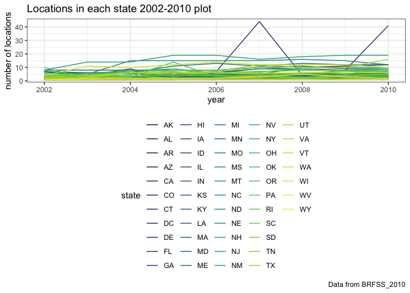
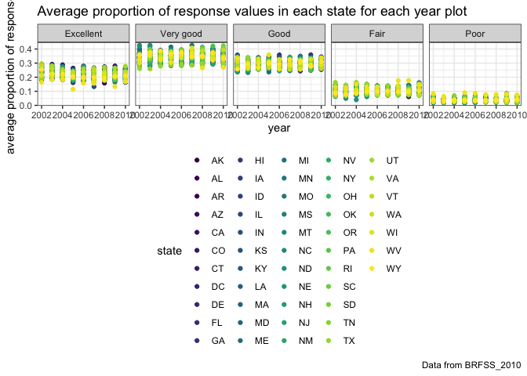
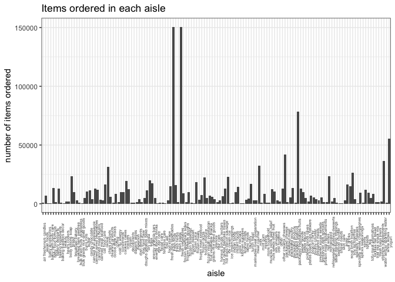

P8105\_hw3\_tj2383
================
Tanvi Jain
10/4/2018

Problem 1
---------

In this code chunk, I did some data cleaning: -formatted the data to use appropriate variable names

-focused on the “Overall Health” topic

-included only responses from “Excellent” to “Poor”

-organized responses as a factor taking levels ordered from “Excellent” to “Poor”

``` r
library(p8105.datasets)
data("brfss_smart2010")

brfss_data = brfss_smart2010 %>% 
  janitor::clean_names() %>% 
  filter(topic == "Overall Health") %>% 
  filter(response == "Excellent" | response == "Very good" | response == "Good" | response == "Fair" | response == "Poor") %>% 
  mutate(response = factor(response, levels = ordered(c("Excellent", "Very good", "Good", "Fair", "Poor"))))
```

In the following code chunks I answer questions about the cleaned brfss\_data:

In this code chunk I answer which states have 7 locations in 2002.

``` r
brfss_data %>% 
  select(year, locationabbr, locationdesc) %>% 
  filter(year == "2002") %>% 
  distinct(locationdesc, locationabbr) %>% 
  group_by(locationabbr) %>% 
  summarize(locations_7 = n()) %>% 
  filter(locations_7 == "7")
```

    ## # A tibble: 3 x 2
    ##   locationabbr locations_7
    ##   <chr>              <int>
    ## 1 CT                     7
    ## 2 FL                     7
    ## 3 NC                     7

In 2002, the states observed with 7 locations are CT, FL, and NC.

This is a spaghetti plot that shows the number of locations in each state from 2002-2010:

``` r
brfss_data %>% 
  select(year, locationabbr, locationdesc) %>% 
  filter(year > 2001 & year < 2011) %>% 
  group_by(locationabbr, year) %>% 
  distinct(locationdesc, locationabbr) %>% 
  summarize(locations_state = n()) %>% 
  ggplot(aes(x = year, y = locations_state, color = locationabbr)) +
  geom_line() +
  labs(
    title = "Locations in each state 2002-2010 plot",
    x = "year",
    y = "number of locations",
    caption = "Data from BRFSS_2010"
  ) +
  viridis::scale_color_viridis(
    name = "state", 
    discrete = TRUE
  ) + 
  theme_bw() + 
  theme(legend.position = "bottom")
```



In this code chunk I make a table of the mean and standard deviation of proportion of "Excellent" responses in NY State in 2002, 2006, and 2010.

``` r
brfss_data %>%
  spread(key = response, value = data_value) %>%
  janitor::clean_names() %>% 
  select(year, excellent, locationabbr) %>% 
  filter(!is.na(excellent) & locationabbr == "NY" & (year == "2002" | year == "2006" | year == "2010")) %>%
  group_by(year) %>% 
  summarize(mean_proportion_excellent = mean(excellent), sd_proportion_excellent = sd(excellent)) %>% 
  knitr::kable()
```

|  year|  mean\_proportion\_excellent|  sd\_proportion\_excellent|
|-----:|----------------------------:|--------------------------:|
|  2002|                     24.04000|                   4.486424|
|  2006|                     22.53333|                   4.000833|
|  2010|                     22.70000|                   3.567212|

In this code chunk I compute the average proportion in each response category (taking the average across locations in a state) for each year and state. Then I make a five-panel plot that shows, for each response category separately, the distribution of these state-level averages over time.

``` r
brfss_data %>% 
  select(year, locationabbr, response, data_value) %>% 
  group_by(year, locationabbr, response) %>% 
  summarize(mean_response = mean(data_value)) %>% 
  ggplot(aes(x = year, y = mean_response, color = locationabbr)) + 
  geom_point() +
  facet_grid(~response) +
  labs(
    title = "Average proportion of response values in each state for each year plot",
    x = "year",
    y = "average proportion of response",
    caption = "Data from BRFSS_2010"
  ) +
  viridis::scale_color_viridis(
    name = "state", 
    discrete = TRUE
  ) + 
  theme_bw() + 
  theme(legend.position = "bottom")
```

    ## Warning: Removed 21 rows containing missing values (geom_point).



Problem 2
---------

Testing inline code:

``` r
library(p8105.datasets)
data("instacart")

instacart_data = instacart %>% 
  janitor::clean_names()

nrow(instacart_data)
```

    ## [1] 1384617

``` r
ncol(instacart_data)
```

    ## [1] 15

``` r
instacart_data %>% 
  count()
```

    ## # A tibble: 1 x 1
    ##         n
    ##     <int>
    ## 1 1384617

``` r
instacart_data %>% 
  distinct(user_id) %>% 
  count()
```

    ## # A tibble: 1 x 1
    ##        n
    ##    <int>
    ## 1 131209

``` r
instacart_data %>% 
  select(user_id) %>% 
  head(1)
```

    ## # A tibble: 1 x 1
    ##   user_id
    ##     <int>
    ## 1  112108

``` r
instacart_data %>% 
  select(product_name) %>% 
  head(1)
```

    ## # A tibble: 1 x 1
    ##   product_name    
    ##   <chr>           
    ## 1 Bulgarian Yogurt

``` r
instacart_data %>% 
  select(department) %>% 
  head(1)
```

    ## # A tibble: 1 x 1
    ##   department
    ##   <chr>     
    ## 1 dairy eggs

The size of the instacart dataset is 1384617 rows and 15 columns. It is an anonymized dataset with grocery orders from instacart users, however, it is not generalizable to the broader instacart user population because it is not a random sample of products, users, or purchases. The dataset contains 1384617 observations and 131209 distinct users. Some key variables in the dataset include `user_id` such as 112108 and the `product_name` variable indicates a product the user purchased, in thiscase Bulgarian Yogurt and the `department` variable indicates which deparment this product came from, in this case, dairy eggs.

In the following code chunk I answer questions about instacart\_data:

``` r
instacart_data %>% 
  select(aisle) %>% 
  count()
```

    ## # A tibble: 1 x 1
    ##         n
    ##     <int>
    ## 1 1384617

``` r
instacart_data %>% 
  group_by(aisle) %>% 
  summarize(amount_ordered = n()) %>% 
  arrange(desc(amount_ordered)) %>% 
  select(aisle) %>% 
  head(1)
```

    ## # A tibble: 1 x 1
    ##   aisle           
    ##   <chr>           
    ## 1 fresh vegetables

There are 1384617 aisles and the most items are ordered from the following aisle: fresh vegetables.

The following plot shows the number of items ordered in each distinct aisle:

``` r
instacart_data %>% 
  group_by(aisle) %>% 
  summarize(amount_ordered = n()) %>% 
  ggplot(aes(x = aisle, y = amount_ordered)) + 
  geom_point() +
  labs(
     title = "Items ordered in each aisle",
     x = "aisle",
     y = "number of items ordered"
    ) +
    theme_bw() +
    theme(legend.position = "bottom")
```



In the following code chunk I create a table of the most popular item in the aisles `baking ingredients`, `dog food care`, and `packaged vegetables and fruits`.

``` r
instacart_data %>% 
  filter(aisle == "baking ingredients" | aisle == "dog food care" | aisle == "packaged vegetables fruits") %>% 
  group_by(aisle, product_name) %>% 
  summarize(number_ordered = n()) %>% 
  arrange(desc(number_ordered)) %>% 
  group_by(aisle) %>% 
  top_n(n = 1) %>% 
  rename(most_popular_item = product_name) %>% 
  knitr::kable()
```

    ## Selecting by number_ordered

| aisle                      | most\_popular\_item                           |  number\_ordered|
|:---------------------------|:----------------------------------------------|----------------:|
| packaged vegetables fruits | Organic Baby Spinach                          |             9784|
| baking ingredients         | Light Brown Sugar                             |              499|
| dog food care              | Snack Sticks Chicken & Rice Recipe Dog Treats |               30|

In the following code chunk I create a table showing the mean hour of the day at which Pink Lady Apples and Coffee Ice Cream are ordered on each day of the week:

``` r
instacart_data %>% 
  filter(product_name == "Pink Lady Apples" | product_name == "Coffee Ice Cream") %>% 
  select(product_name, order_dow, order_hour_of_day) %>% 
  group_by(order_dow, product_name) %>% 
  summarize(mean_hour = mean(order_hour_of_day)) %>% 
  spread(key = order_dow, value = mean_hour) %>% 
  knitr::kable()
```

| product\_name    |         0|         1|         2|         3|         4|         5|         6|
|:-----------------|---------:|---------:|---------:|---------:|---------:|---------:|---------:|
| Coffee Ice Cream |  13.77419|  14.31579|  15.38095|  15.31818|  15.21739|  12.26316|  13.83333|
| Pink Lady Apples |  13.44118|  11.36000|  11.70213|  14.25000|  11.55172|  12.78431|  11.93750|

Problem 3
---------

Testing in line code for a description of the dataset:

``` r
library(p8105.datasets)
data(ny_noaa)

nrow(ny_noaa)
```

    ## [1] 2595176

``` r
ncol(ny_noaa)
```

    ## [1] 7

``` r
ny_noaa %>% 
  count()
```

    ## # A tibble: 1 x 1
    ##         n
    ##     <int>
    ## 1 2595176

``` r
ny_noaa %>% 
  distinct(id) %>% 
  count()
```

    ## # A tibble: 1 x 1
    ##       n
    ##   <int>
    ## 1   747

``` r
ny_noaa %>% 
  select(date) %>% 
  head(1)
```

    ## # A tibble: 1 x 1
    ##   date      
    ##   <date>    
    ## 1 2007-11-01

``` r
ny_noaa %>% 
  select(prcp) %>% 
  head(1)
```

    ## # A tibble: 1 x 1
    ##    prcp
    ##   <int>
    ## 1    NA

``` r
ny_noaa %>% 
  select(tmax) %>% 
  head(1)
```

    ## # A tibble: 1 x 1
    ##   tmax 
    ##   <chr>
    ## 1 <NA>

``` r
ny_noaa %>% 
  select(tmin) %>% 
  head(1)
```

    ## # A tibble: 1 x 1
    ##   tmin 
    ##   <chr>
    ## 1 <NA>

``` r
ny_noaa %>% 
  filter(is.na(tmax) | is.na(tmin) | is.na(prcp) | is.na(snow) | is.na(snwd)) %>% 
  nrow()
```

    ## [1] 1372743

The size of the NOAA dataset is 2595176 rows and 7 columns. This public dataset provides information on weather and this specific version contains information from weather stations in NY state. The dataset contains 2595176 observations and 747 distinct weather stations. Some key variables in the dataset include `id` such as US1NYAB0001 and the `date` variable indicates the date of the weather observation 2007-11-01. The `prcp` variable indicates the precipitation that occurred on this date. The `tmax` and `tmin` variable tell us the maximum and minimum temperatures on this date. There are several missing data values in this data set, especially for prcp, tmin, and tmax, precisely 1372743 missing observations.

In this code chunk I clean the dataset ny\_noaa\_data: -created separate variables for year, month, and day -ensure observations for temperature, precipitation, and snowfall are given in reasonable units

``` r
ny_noaa_data = ny_noaa %>%
  janitor::clean_names() %>% 
  separate(date, into = c("year", "month", "day"), sep = "-") %>%
  mutate(prcp = prcp / 10, tmax = as.integer(tmax) / 10, tmin = as.integer(tmin) / 10)

ny_noaa_data %>% 
  group_by(snow) %>% 
  summarize(freq_observed = n()) %>% 
  arrange(desc(freq_observed)) %>% 
  head(1)
```

    ## # A tibble: 1 x 2
    ##    snow freq_observed
    ##   <int>         <int>
    ## 1     0       2008508

The most commonly observed value for snowfall was 0 mm because snowfall is not observed at high frequency throughout the year especially during the spring, summer, and fall months.
